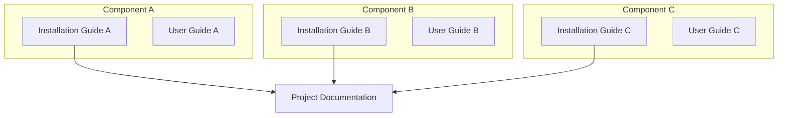

<h1 align="center">Installation Guide - Guideline</h1>

To set up the system, follow these steps:

1. Clone the repository using `git clone https://github.com/openairinterface5g/openairinterface.git`.
2. Run `make setup` to configure the environment and build the necessary components.
3. Start the system using `./openaircore start`.

# Installation Guide - Guideline

> Make this document **private** by default. Only make it public after publishing the paper of this project.
>
> Request access with the GitHub admin in our group.

---

> [!NOTE]
> **Purpose of Installation, Integration, and User Guide**:
>
> - **Installation Guide**: Focuses on setup, configuration, and getting the system running.
> - **User Guide**: Focuses on how to **use** the system once it's installed and running.
> - **Project Documentation**: Define `System Architecture` & attach the installation guide link, `use case diagram`, `message-sequence chart (MSC)`, `class diagram`, `flowchart`.

Correlation between Installation, User Guides, and Project documentation:

## Table of Contents

> [!TIP]
> Generate the Table of Contents automatically using [Markdown All in One extension in VS Code](https://marketplace.visualstudio.com/items?itemName=yzhang.markdown-all-in-one#table-of-contents).

- [Table of Contents](#table-of-contents)
- [Project description](#project-description)
- [Execution Status](#execution-status)
  - [System Architecture](#system-architecture)
  - [Repository Structure](#repository-structure)    - [Configuration](#configuration)
    - [Installation Steps](#installation-steps)
- [Post-Installation Verification](#post-installation-verification)
- [Troubleshooting](#troubleshooting)    - [Common Issues and Solutions](#common-issues-and-solutions)

# Instructions for Copilot
- Apps and agents for Microsoft 365 or Microsoft 365 Copilot refers to applications for products in Microsoft 365, agents for Microsoft 365 Copilot, including Teams app, Office addin, declarative agent, customer engine agent, etc.
- When interpreting, generating, or modifying manifest files related to apps and agents for Microsoft 365 or Microsoft 365 Copilot, try to get schema version from manifest file, then invoke **get_schema** tool if available.
- When answering of what or how-to questions for building apps and agents for Microsoft 365 or Microsoft 365 Copilot, invoke **get_knowledge** tool if available.
- Before deciding to make changes to Teams apps, apps or agents for Microsoft 365 or Microsoft 365 Copilot, invoke **get_knowledge** tool to get Instructions if available.
- When troubleshooting issues

# Installation Guide - Guideline
## Installation Guide - Guideline

<h1 align="center">Installation Guide - Guideline</h1>

To set up the system, follow these steps:

1. Clone the repository using `git clone https://github.com/openairinterface5g/openairinterface.git`.
2. Run `make setup` to configure the environment and build the necessary components.
3. Start the system using `./openaircore start`.

## Table of Contents 

> [!TIP]
> Generate the Table of Contents automatically using [Markdown All in One extension in VS Code](https://marketplace.visualstudio.com/items?itemName=yzhang.markdown-all-in-one#table-of-contents).

# Installation Guide - Guideline

<h1 align="center">Installation Guide - Guideline</h1>
To set up the system, follow these steps:
1. Clone the repository using `git clone https://github.com/openairinterface5g/openairinterface.git`.
2. Run `make setup` to configure the environment and build the necessary components.
3. Start the system using `./openaircore start`.

## Installation Guide - Guideline

# Installation Guide - Guideline
Our servers are put in the server room. Please contact the admin for VPN access.

Host: <IP address>
User: <username>\n\n# The authenticity of host `<IP address>` (\'<IP address\>' ) can't be established.\n# ECDSA key fingerprint is SHA256:xxxxxxxxxxxxxxxxxxxxxxxxxxxxxxxxxx

# Installation Guide - Guideline

# Installation Guide - Guideline
## Installation Guide - Guideline
### OUTPUT FORMAT
## Installation Guide - Guideline
# Installation Guide - Guideline
## Installation Guide - Guideline
# Installation Guide - Guideline
## Installation Guide - Guideline
# Installation Guide - Guideline

## TOC

# Installation Guide - Guideline
## Installation Guide - Guideline
### Installation Guide - Guideline
# Installation Guide - Guideline
## Installation Guide - Guideline
